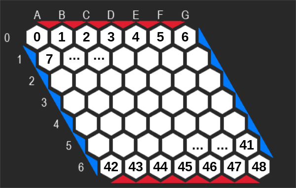

# Jeu de HEX

## Scénario

Le jeu de “Hex” est un jeu de société stratégique pour deux joueurs. Il a été inventé par le mathématicien danois Piet Hein en 1942 et redécouvert indépendamment par le mathématicien et physicien John Nash dans les années 1940. Le jeu se joue sur un plateau en forme de losange composé de hexagones. La taille standard du plateau est de 11x11, mais il peut varier (nous avons utilisé une grille de 7x7 pour l'apprentissage).

Chaque joueur possède des pions d'une couleur spécifique. Les joueurs placent alternativement un de leurs pions sur un hexagone vide du plateau. L'objectif du jeu est de former un chemin continu reliant les deux côtés opposés du plateau marqués par la couleur du joueur. Le premier joueur à réussir à créer un tel chemin gagne la partie.

Ce qui rend “Hex” intéressant, c'est qu'il est impossible qu'il y ait un match nul ; l'un des deux joueurs gagnera inévitablement. Cela est dû à la structure du plateau et aux règles de jeu. Hex est également connu pour sa profondeur stratégique. Bien qu'il soit simple à apprendre, il offre une complexité et une variété de stratégies importante.
“Hex” est non seulement un jeu divertissant mais aussi un sujet d'étude dans les domaines de la théorie des jeux et de l'intelligence artificielle. Il représente un défi intéressant pour les algorithmes d'IA en raison de sa simplicité apparente et de sa complexité sous-jacente.

## Objectif

## Rapport technique

# Processus d'apprentissage

Le processus processus d’apprentissage avec deux IA vierges qui joue l’une contre l’autre.

Ce processus permettra de générer un très grand nombre de parties très rapidement sans attendre qu’un joueur humain joue. En comparaison avec un apprentissage humain VS IA, la courbe d’apprentissage risque d’être plus faible au début mais permettra de développer des stratégies sans être limité par les biais cognitifs humain. D’un autre côté, elle ne pourra pas utiliser ces biais pour générer des stratégies.

Une fois un très grand nombre de parties de simulés, nous pourront l’utiliser pour jouer contre elle.

## Création du dataset

Le fichier `HEX_dataset.csv` rassemble les données d'environ 2000 parties qui ont servies pour l'entrainement. Le jeu a été lancé avec les paramètres suivants (fichier `main.py`) :
 - `BOARD_SIZE = 7` : plateau de 7x7 cases
 - `ITERMAX = 1000`: nombre d'itérations utilisées par l'algorithme MCTS pour jouer des coups automatiquement
 - `MODE = "cpu_vs_cpu"` : pas de joueur humain, c'est l'algo qui joue tout seul

## Format des données

Un fichier CSV est créé dans le dossier `games_log` pour chaque partie jouée et contient tout son historique.

Chaque ligne réprésente un coup à jouer et contient l'état actuel du plateau, une indication sur le joueur qui doit jouer ce coup, une indication sur le joueur qui a finalement gagné cette partie ainsi qu'un indication sur la case qui a été choisie pour ce coup.

### Colonnes

 - colonnes `Case_0` à `Case_48` : état actuel du plateau selon leurs index (voir ci-dessous) :
    - `0` si la case est libre
    - `1` si elle est occupée par un pion du joueur 1 (bleu)
    - `2` si elle est occupée par un pion du joueur 2 (rouge)
 - colonne `Joueur` : id du joueur qui doit jouer le coup (1 = bleu, 2 = rouge)
 - colonne `Victoire` : id du joueur qui a finalement gagné cette partie
 - colonnes `Case_0_score` à `Case_48_score` : case choisie par le joueur pour jouer ce coup :
    - `0` si la case n'a pas été choisie
    - `1` si la case a été choisie par le joueur (une seule par tour)

## Création du modèle (MLP)

Pour générer notre MLP (MultiLayer Perceptron) nous utilisons le logicel JNNET 1.3.2

## Rapport d'utilisation

Pour appeler le modèle :

`subprocess.run(["java", "-jar", AI_ENGINE_PATH, "-m", AI_MLP_PATH, "-i", self.iFile, "-o", self.oFile])`
